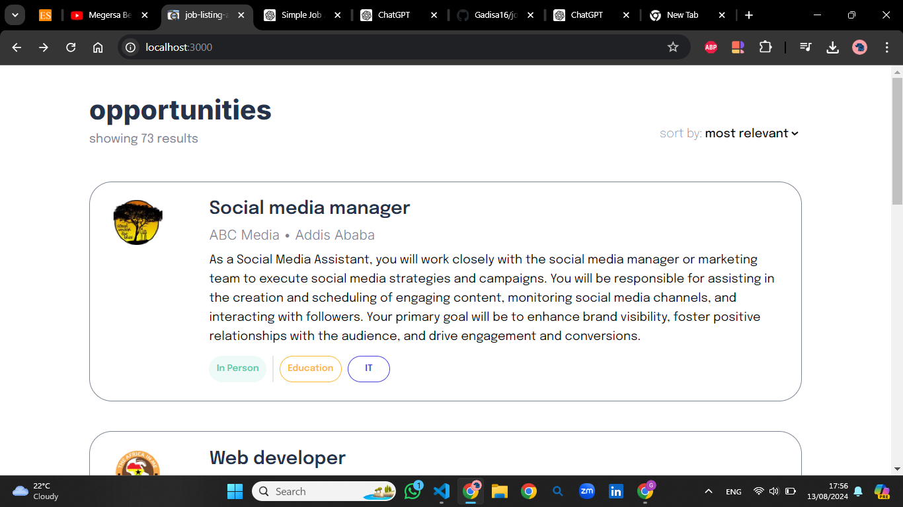
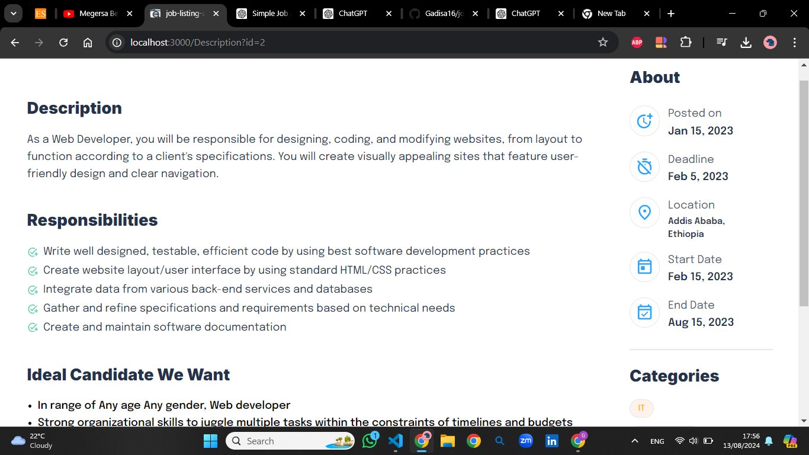

## Job Listing Application

This project is a fully responsive job listing application built with Next.js and TypeScript. It allows users to view job listings and see detailed descriptions when a job card is clicked. The job data is fetched from a static JSON file (`jobs.json`) in the public folder.

## Features

   **Responsive Design**: The application is designed to be fully responsive, ensuring a smooth user experience on all device sizes.
   **Job Cards**: Each job card is dynamically generated using data from the jobs.json file with relevant information like the job title, company name, and location.
   **Detailed Job Descriptions**: Clicking on a job card navigates to a page with detailed information about the selected job.
   - **Static Data Handling**: The job data is fetched from a local `jobs.json` file, demonstrating how to work with static data in a Next.js project.
   **Styled with Tailwind CSS**: The design closely follows the provided Figma file, utilizing Tailwind CSS for styling.

## This is screenshoots which shows part of pages:
   
   

## Getting Started

### Prerequisites

- Node.js
- npm or yarn

### Installation

1. Clone the repository:
   ```bash
   git clone https://github.com/Gadisa16/job-listing-app.git
